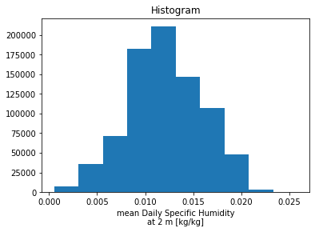
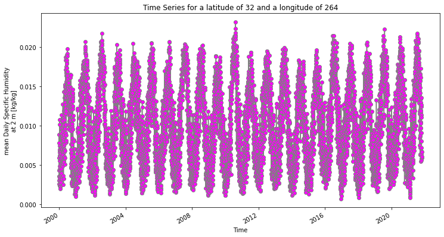

Sierra Bettis
HAS-Tools

1. A brief summary of the how you chose to generate your forecast this week.

To get this weeks forecasts, I found the values how I usually do, by using the USGS data for the Verde River near Camp Verde and I use the novemeber mean values from 2015-2020. 

2. A description of the dataset you added
    What is the dataset? Why did you choose it?

The dataset is a net CDF and I chose to use it because the data was easier to manipulate. 

    What is the spatial and temporal resolution and extent of the data?

The data is metadata and but then I opened the dataset inside to find the variable I wanted. The lat, lon, and shum varaibles are float values and the time values are a dataset. This dataset has 3 dimensions, where the lat has 2 values, the lon has 51 values, and the time has 7976 values.

    Where did you get the data from?

I got the data from NOAA and I chose to look at a dataset of the daily mean surface specific humidity.

    What was your approach to extracting and aggregating it into something useful to you?

First I navigated to the wesbite and chose a variable or variables that are of interest. Then, by reading the file into the python script, I could exract the variable of daily mean surface specific humidity.

3. A plot of the dataset you added. This can be a timeseries, map, histogram or any other plot that you think is a good summary of what you added.

4. Finally add your plot and a brief summary of what you did to our slide deck for this week. 

I changed the graph provided by searching what color relative humidity should be when portrayed graphically, and changed the title to better fit the data. 
