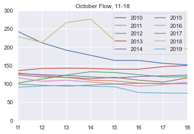
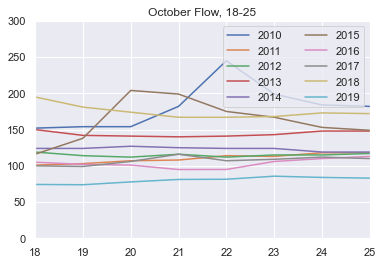
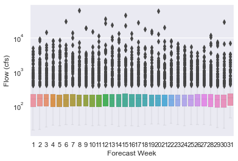

Sierra Bettis
Homework 7
HAS-Tools

Evaluator: Xiang Zhong

Week 1 and 2 Forcast Submission Values: 115, 144

Printed information from the script: 

    Iteration 0 Day= 1 Flow= 130.06666666666666
    Iteration 1 Day= 2 Flow= 130.36666666666667
    Iteration 2 Day= 3 Flow= 161.78333333333333
    Iteration 3 Day= 4 Flow= 278.65000000000003
    Iteration 4 Day= 5 Flow= 140.4
    Iteration 5 Day= 6 Flow= 128.5
    Iteration 6 Day= 7 Flow= 162.5666666666667
    Iteration 7 Day= 8 Flow= 153.06666666666666
    Iteration 8 Day= 9 Flow= 148.48333333333332
    Iteration 9 Day= 10 Flow= 131.26000000000002
    Iteration 10 Day= 11 Flow= 122.32000000000001
    Iteration 11 Day= 12 Flow= 116.9
    Iteration 12 Day= 13 Flow= 128.0
    Iteration 13 Day= 14 Flow= 128.73999999999998
    Iteration 14 Day= 15 Flow= 116.47999999999999
    Iteration 15 Day= 16 Flow= 112.1
    Iteration 16 Day= 17 Flow= 110.2
    Iteration 17 Day= 18 Flow= 109.47999999999999
    Iteration 18 Day= 19 Flow= 106.35999999999999
    Iteration 19 Day= 20 Flow= 107.92
    Iteration 20 Day= 21 Flow= 108.08
    Iteration 21 Day= 22 Flow= 106.08
    Iteration 22 Day= 23 Flow= 110.35999999999999
    Iteration 23 Day= 24 Flow= 113.12
    Iteration 24 Day= 25 Flow= 114.25999999999999
    show more (open the raw output data in a text editor) ...

    Iteration 26 Day= 27 Flow= 118.84
    Iteration 27 Day= 28 Flow= 121.38
    Iteration 28 Day= 29 Flow= 122.02000000000001
    Iteration 29 Day= 30 Flow= 124.6
    Iteration 30 Day= 31 Flow= 125.8
    array([130.06666667, 130.36666667, 161.78333333, 278.65      ,
        140.4       , 128.5       , 162.56666667, 153.06666667,
        148.48333333, 131.26      , 122.32      , 116.9       ,
        128.        , 128.74      , 116.48      , 112.1       ,
        110.2       , 109.48      , 106.36      , 107.92      ,
        108.08      , 106.08      , 110.36      , 113.12      ,
        114.26      , 117.24      , 118.84      , 121.38      ,
        122.02      , 124.6       , 125.8       ])

---
    My forecast for week 1 is  115.0 cfs
    My forecast for week 2 is  144.0 cfs
    Flow seems to be larger for the second week forecast

3 plots that were generated from the script:

2018 had a an above average flow on the 13th and 14th of the month

2010 had an above average flow on the 22nd

Code Rubric:
1. Is the script easy to read and understand? (6/10)
 - Are variables and functions named descriptively when useful?
   Line 42-43: Used same name for a variable inside the function, which I would suggest better not.
   Other names are fine.
 - Are the comments helpful?
   Yes.
 - Can you run the script on your own easily?
   Line 17: Filename should be 'streamflow_week7.txt'. (New data is not there yet, so I downloaded it myself.)
   Line 18: This line does not work for Windows system. (Changed it accordingly.)
   Line 40-51: Error of file not found. (Changed line 18 from 1 '..' to 2 '..'.)
 - Are the doc-strings useful?
   There is no doc-string.

2. Does the code follow PEP8 style consistently? (6/10)
 - If not are there specific instances where the script diverges from this style?
   Line 5-6, 10: Imported but unused.
   Line 11, 46: Line too long.
   Line 25, 49, 56, 58, 67, 79: Improper indent.
   Line 36, 67, 79: Missing whitespace.
   Line 42, 51: Missing blank lines.
   Line 42, 51, 57, 69-71, 82-83: Extra whitespace.
   Line 54: Extra leading '#'.
   Line 11, 42, 48, 55, 57, 87: Trailing whitespace.

3. Is the code written succinctly and efficiently? (8/10)
 - Are there superfluous code sections?
   There are some not used packages imported but not used.
   The print meassages are not really necessary, and so are some attribute shown lines.
   Line 36: Made a numpy array of data to find forecast submission values on Line 55-58. Extract data from data frame directly could also manage that, and that would be more terse.
 - Is the use of functions appropriate?
   Functions are used correctly, but self defined function was not very helpful for forecasting.
 - Is the code written elegantly without decreasing readability?
   The codes are ok, but with some redundant information. There are some errors, but basically easy to read. If the plots are saved instead of just printed out would be more helpful.